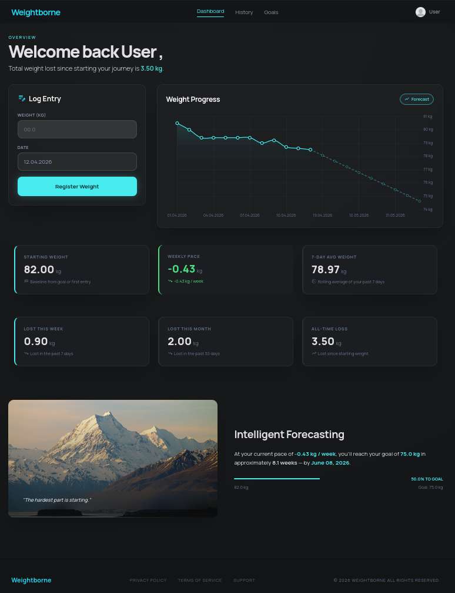
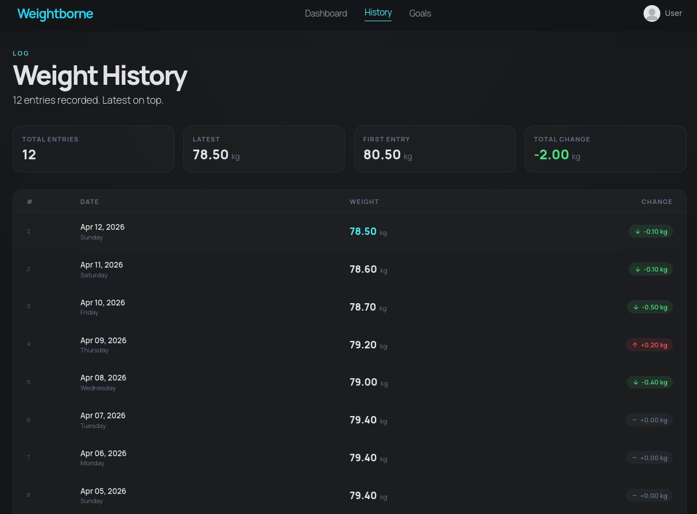

# Weightborne

[](https://github.com/PlanckPrecision/health-tracker-api/actions/workflows/ci.yml)


I've been logging my weight daily for years and couldn't find a tool that balanced simplicity with meaningful analytics, thus I built one myself. Weightborne is a full stack Flask web app with SQLAlchemy backed data persistence, a session auth system, and a Chart.js dashboard that computes pace based forecasting from a rolling weekly average to project your goal date in real time. The goal was a clean, dark-themed UI with no bloat, just the metrics that I want when I am tracking my weight towards a given goal.



---

## Features

- **Daily logging** — enter weight by date with validation (range, decimal precision, duplicate guard)
- **Delete entries** — remove individual log entries from the history table
- **Dashboard analytics** — Starting weight, 7-day pace, 30-day loss, all-time loss, and dynamic forecast to goal date
- **Interactive chart** — toggle a forecast overlay projected from your current weekly pace to visualise on what date the goal weight will be achieved, based on current metrics and trends
- **Goal tracking** — set a target weight; progress bar and estimated time of arrival for goal date update automatically
- **Auth** — signup, login, change username/password, reset journey (requires password + typed "RESET")
- **Session security** — `SameSite=Strict`, `HttpOnly` cookies, Werkzeug password hashing

---

## Stack

| Layer | Technology |
|---|---|
| Backend | Python 3.12, Flask, SQLAlchemy |
| Auth | Flask-Login, Werkzeug |
| Database | SQLite (dev) via Flask-Migrate |
| Frontend | Jinja2, Tailwind CSS (CDN), Chart.js v4 |

---

## Quickstart

```bash
git clone https://github.com/PlanckPrecision/health-tracker-api.git
cd health-tracker-api
python -m venv .venv && source .venv/bin/activate
pip install -e ".[dev]"
cp .env.example .env          # add a SECRET_KEY value
flask db upgrade
python main.py
```

Open `http://127.0.0.1:5000`.

---

## Project Structure

```
health-tracker-api/
├── app/
│   ├── __init__.py       # app factory
│   ├── models.py         # database models
│   ├── validate.py       # input validation and stat calculations
│   ├── routes/
│   │   ├── auth.py       # authentication routes
│   │   └── entries.py    # weight entry and dashboard routes
│   ├── templates/        # Jinja2 HTML templates
│   └── static/           # JS and images
├── migrations/           # Alembic migration scripts
├── tests/
├── main.py
└── pyproject.toml
```

---

## Environment Variables

Copy `.env.example` to `.env` and fill in:

```
SECRET_KEY=your-secret-key-here
```

---

## Roadmap

- [x] Pytest suite for auth and validation
- [x] GitHub Actions CI (lint + test on push)
- [ ] PostgreSQL support for production deployment
- [ ] Export entries as CSV

---

## Screenshots

| Dashboard (forecast active) | History |
|---|---|
|  |  |

---

## Demo


